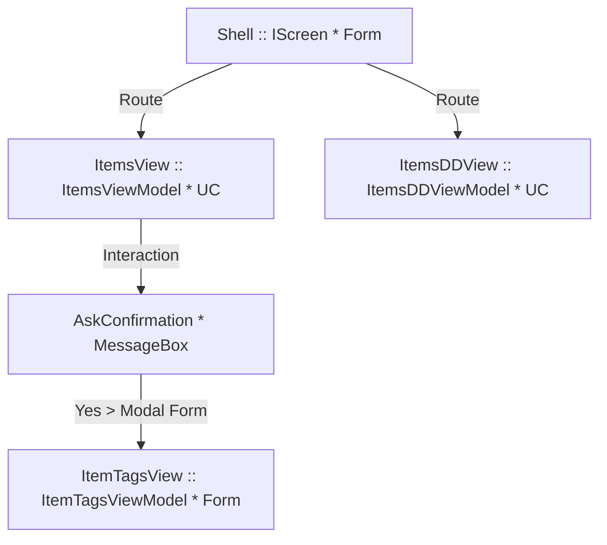

# winforms-reactiveui-demo

Winforms .net Core 6 + ReactiveUI and DynamicData

## Goals

The goal of this demo is to show how to deal with the most common scenarios for a Desktop application.
The application implements:

- Dependency injection with Splat, views, and services.
- How to use a main entry-point with Routing and UserControls.
- How to open a new Form (outside the main routing).
- Routing between screens/views.
- Binding data and execute commands between View and ViewModel.
- Bind to reactive properties (as calculated fields).
- How to bind data to a ListBox via DataSource. [More info on DataSource](https://docs.microsoft.com/en-us/dotnet/api/system.windows.forms.listcontrol.displaymember?view=windowsdesktop-6.0).
- How to deal with UI events (via `ReactiveMarbles.ObservableEvents.SourceGenerator`). See the note below.
- How to use Interactions to show Modal form with or without DialogResult.
- How to subsribe to UI changes like TextBox and ComboBox with sort info, and refresh the data in the UI.
- How to use Dynamic Data and deal with Collections. See the note below.
- etc.

### Note related to RxUi WinForms events

RxUI WinForms doesn't support `Bind` yet.
So there is a temporary solution to support events that don't implement INotifyPropertyChanged.

### Note related to Dynamin Data

The demo is using Dynamic Data, but be carefull that WinWorms supports only binding to `BindingList<T>`. [More info on BindingList](https://docs.microsoft.com/en-us/dotnet/api/system.componentmodel.bindinglist-1?view=net-6.0).

### Routing and Views structure

